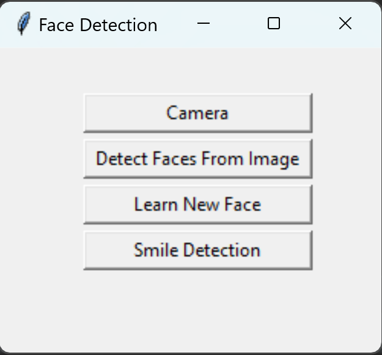

# Face Detection

## Libraries
 - cv2 ------------------ ***pip3 install opencv-python***
 - numpy -------------- ***pip3 install numpy***
 - pandas -------------- ***pip3 install pandas***
 - tkinter ---------------- ***pip3 install tk***
 - PIL--------------------- ***pip3 install Pillow***
 - face_recognition --- ***pip3 install face-recognition***

## How it works

Purpose of this project is to work and learn about **face_recognition**, **cv2**, and **tkinter** libraries in Python. 
When you run the source code successfully, you will see a menu that has four buttons in it, 
which are **Camera**, **Detect Face From Image**, **Learn New Face**, and **Smile Detection**.

Before showing this menu, the code will check the images inside the data folder.
Currrently, it supports only **.jpg**, **.jpeg**, and **.png** image file types.
While checking the images in the data folder, it will check if the image has been loaded 
before by checking the **trained.parquet** file. This file keeps the information about 
the image files that are previously loaded, such as file name and encoding. 
If it is not loaded before, program will add the new image information to there and save it.
There is a default parameter which is called `DELETE_IMAGE_AFTER_SAVE`. 
This parameter is set to `True` as default, which means after it loads the image, 
it will delete the image file from the data folder. 
So, if you don't want to delete images after it loads, make sure to change it to `False`.

#### Camera Button

When you click the camera button, it will open your default camera in your computer and try to recognize 
everyone in the camera based on the **trained.parquet** file. 
If it identifies the person, it will print their name, and it will print `Unkown Person` for all it is not recognized.

#### Detect Face From Image Button

Detect Face From Image button will open a file selector, 
which allows you to select only supported image files. 
After you select an image, it will check the trained.parquet file to see 
if there are any matches. Then, it will open the image and print the people's names 
if it can identify them. Otherwise, it will print `Unkown Person`for all it could not recognize.

#### Learn New Face Button

This button will open a file selector, which allows you to select only supported image files. 
That allows the program to learn a new face and add information to the `trained.parquet` file,
and save it.

***`NOTE : The program expects you to name the image file with the person's name.
For example, if you want to load Jon Bon Jovi's face, find his picture and name it "Jon Bon Jovi.jpg".
Otherwise, if it is named "IMG_1000.jpg", It will print "IMG_1000" when it sees Jon Bon Jovi.`***

#### Smile Detection Button

This button is similar to the Camera button. 
The main difference is it does not use the **face_recognition** library. 
Instead, it uses the `haar cascade` classifier to identify **faces**, **eyes**, and **smiles** in the camera. 
It is not going to recognize any faces or print their names.